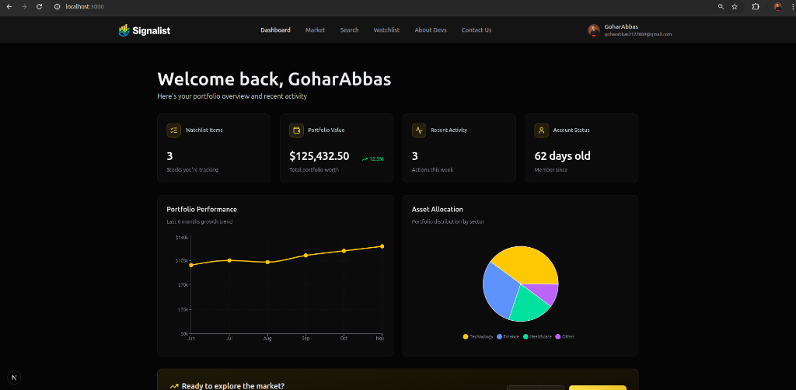
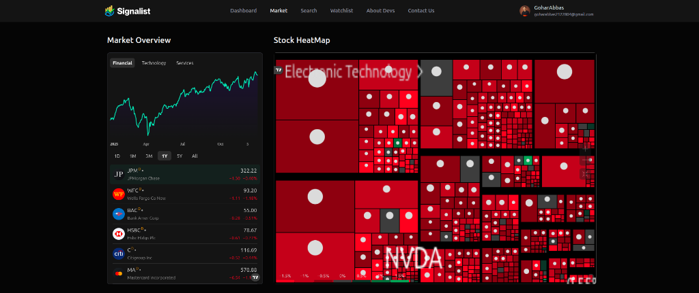
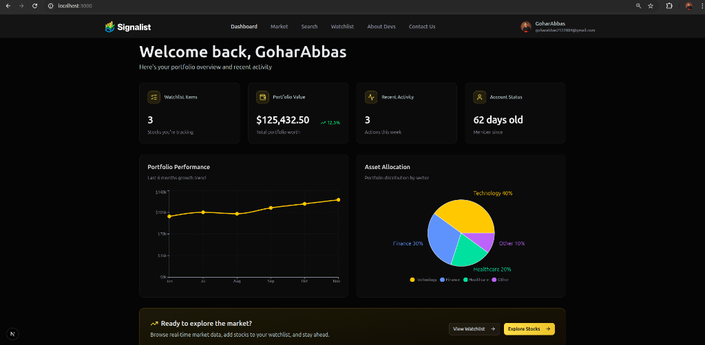
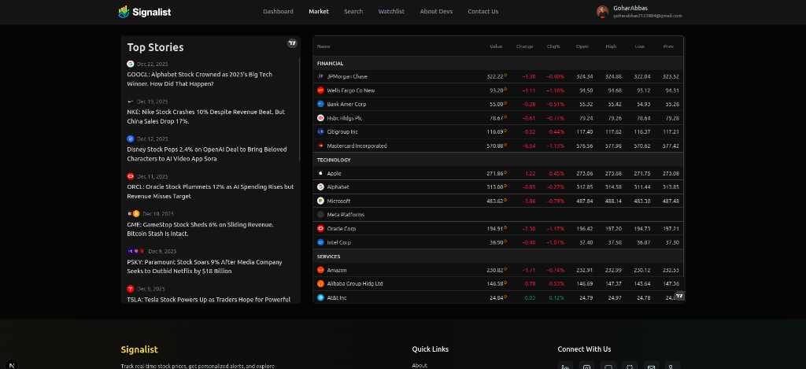

# Signalist – Stock Market Analyzer

Signalist is a modern stock market dashboard that helps you research tickers, track a personal watchlist, view market insights with TradingView widgets, and receive helpful emails like personalized welcomes and daily news summaries.

**GitHub Repository:** [https://github.com/GoharAbbas2122804/Signalist-StockMarketAnalyzer](https://github.com/GoharAbbas2122804/Signalist-StockMarketAnalyzer)


## 🚀 How I Made This Project

Signalist was built to solve the need for a personalized, intelligent financial dashboard. The goal was to combine real-time market data with AI-driven insights in a seamless user interface.

### Tech Stack & Rationale

- **Next.js 15 (App Router)**: Chosen for its robust server-side rendering capabilities, ensuring fast initial loads and SEO-friendly pages.
- **MongoDB & Mongoose**: Selected for its flexibility in handling user profiles and dynamic watchlists without rigid schema constraints.
- **Tailwind CSS 4**: Used for rapid UI development and ensuring a modern, responsive design system.
- **Inngest**: Implemented to handle complex background workflows (like daily email summaries) reliably without managing cron infrastructure.

## 🔌 APIs Used & Why

1.  **Finnhub API**:
    - _Why_: Provides reliable, real-time stock quotes, market news, and company profiles. It's the core data source for the dashboard.
2.  **Google Gemini AI**:
    - _Why_: Powers the intelligent text summarization for news emails and personalized user interactions, making the app feel "smart".
3.  **Web3Forms**:
    - _Why_: A lightweight, serverless solution for the "Contact Us" form. It allows sending emails directly from the frontend without setting up complex SMTP servers for simple user feedback.
4.  **Better Auth**:
    - _Why_: A modern, comprehensive authentication solution that handles secure sessions, database adapters, and middleware protection out of the box.

## 📸 Screenshots & Pages

### Dashboard

The central hub for your portfolio overview and account status.


### Market Overview

Real-time tracking of major indices and market trends.


### Stock Heatmap

Visual representation of market performance across sectors.


### Watchlist

Your personalized list of tracked stocks with quick metrics.


### Top Stories

Curated market news to keep you informed.


---

## 🛠️ Getting Started (Setup)

Follow these steps to set up the project locally:

1.  **Clone the Repository**

    ```bash
    git clone https://github.com/GoharAbbas2122804/Signalist-StockMarketAnalyzer.git
    cd Signalist-StockMarketAnalyzer
    ```

2.  **Install Dependencies**

    ```bash
    npm install
    ```

3.  **Configure Environment Variables**
    Create a `.env.local` file in the root directory and add the following keys:

    ```env
    # Database
    MONGODB_URI=your_mongodb_connection_string

    # Authentication
    BETTER_AUTH_SECRET=your_secret_key
    BETTER_AUTH_URL=http://localhost:3000

    # Email Services
    NODEMAILER_EMAIL=your_email@gmail.com
    NODEMAILER_PASSWORD=your_app_password
    NEXT_PUBLIC_WEB3FORMS_ACCESS_KEY=your_web3forms_key

    # APIs
    GEMINI_API_KEY=your_gemini_api_key
    NEXT_PUBLIC_FINNHUB_API_KEY=your_finnhub_key
    ```

4.  **Run the Development Server**

    ```bash
    npm run dev
    ```

    Open [http://localhost:3000](http://localhost:3000) to view the app.

---

## 📂 App Structure & Features

### Core Features

- **Authentication**: Secure sign-up/login with Better Auth.
- **Watchlist**: Add/remove stocks to track them in real-time.
- **Market Data**: Live charts, candles, and company info via Finnhub & TradingView.
- **AI Integration**: Daily news summaries delivered to your email.
- **Contact Form**: Reach out to the developers (powered by Web3Forms).

### Directory Structure

- `app/`: Next.js routes and pages.
- `lib/`: Utility functions, API clients (Inngest, Finnhub), and actions.
- `Database/`: Mongoose models and connection logic.
- `components/`: Reusable UI components.

---

Made with ❤️ by **Gohar Abbas** & **Shoaib Akhtar**.
